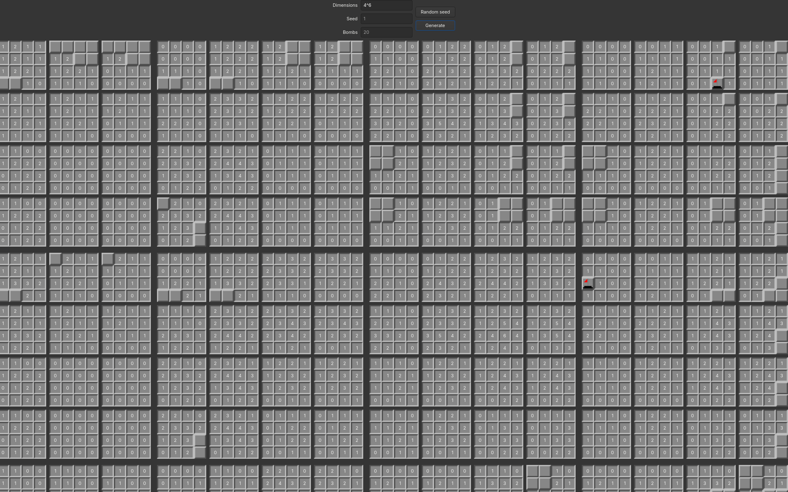

# Multidimensional minesweeper with GTK4

Multidimensional minesweeper made with GTK4

## How to play

You have an n dimensional field. Your goal is to find every mine in it. The numbers indicate how many mines are in the surrounding volume. Have fun finding all the mines!



### Controls

Movement wraps. So if you max out in one dimension, it gets set to 0 and the second next dimension gets incremented.

<pre>
  Move right in x:        right arrow, l
  Move left in x:         left arrow, h
  Move up in y:           up arrow, k
  Move down in y:         down arrow, j
  Move right in z:        d, ctrl-l
  Move left in z:         a, ctrl-h
  Move up in q:           w, ctrl-k
  Move down in q:         s, ctrl-j
  Mark mine:              m, e, right click
  Uncover cell:           space, left click
  Find empty cell:        f (only possible at the start of the game) (if nothing happens, no empty cell was found)
  Forfeit up:             g
  Pause game:             p
  Start new game:         n (creates a new seed based on the current time (looks weird when spamming and doesn't update the seed input))
</pre>

## Compiling and running

Make sure you have GTK4 installed

```
sudo pacman -S gtk4
```

Then run make

```
make
```

And then

```
./main
```

> [!WARNING]
> I have only tested it on Arch Linux. I don't know if it would work on Windows or Mac or if I'd need to add some extra flags, to make it compile on other Linux distros

## TODO

- [x] Toggle between delta and absolute mode
- [x] Fix random seed button
- [x] Highlight area of influence
- [x] Add pause and forfeit functions

## Special thanks

To [GNU](https://www.gnu.org/) for their licence

To [GTK](https://www.gtk.org/)

To [EsultaniK](https://github.com/ESultanik) and [Wallabra](https://github.com/wallabra) for writing the code for the [Mersenne twister](https://github.com/ESultanik/mtwister)

To Julian Schlüntz for creating [4D Minesweeper](https://store.steampowered.com/app/787980/4D_Minesweeper/) on steam, the original inspiration for this project
